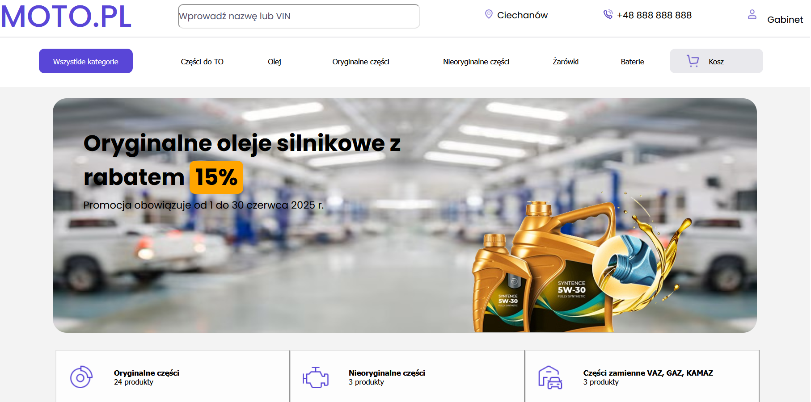
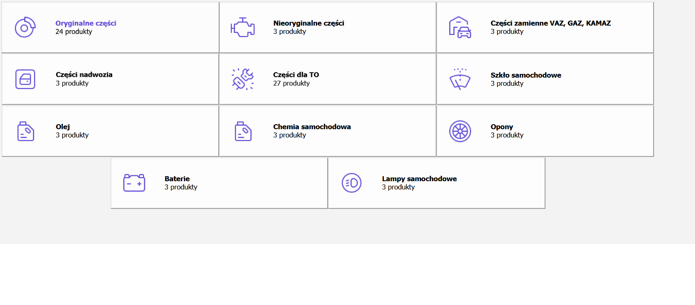
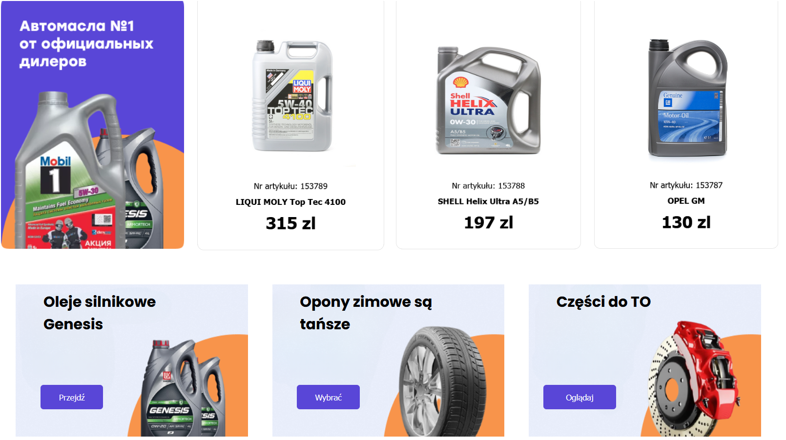
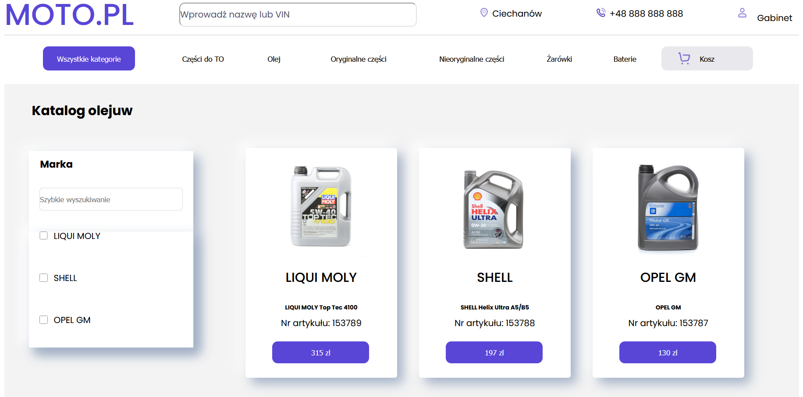
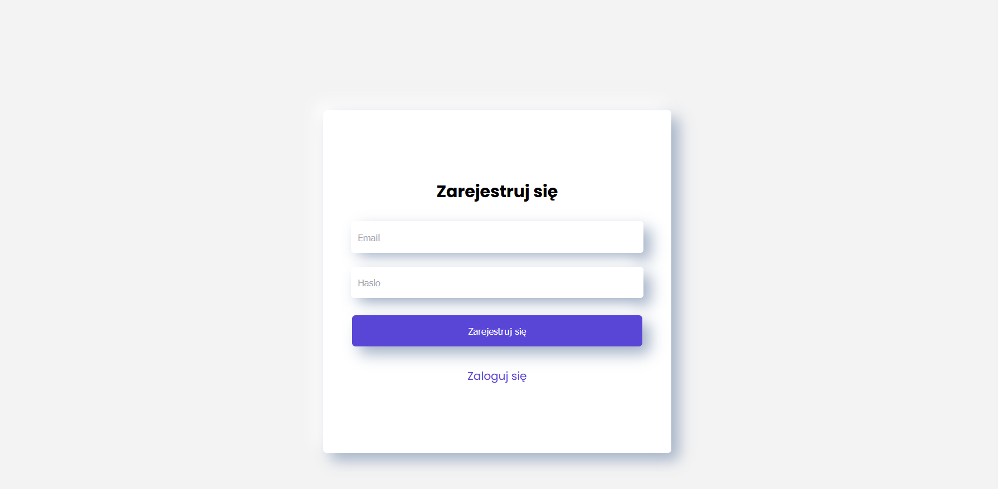
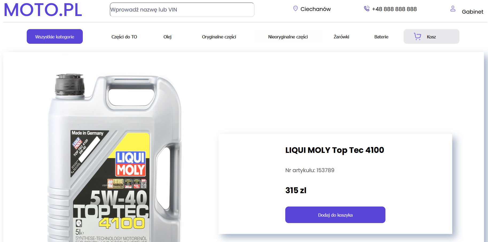
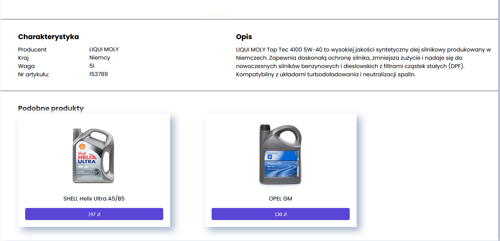

# 🛒 AutoParts — Online Auto Parts Store

This is my **first serious web project**, representing a fully functional online auto parts store. The site is built from scratch using PHP, along with HTML, CSS, and JavaScript. The project demonstrates the basic features of an online shop and serves as an example for a portfolio or educational work.

---

## 🚀 Key Features

- 🔐 User registration and login
- 📂 Product categories (batteries, oil, bulbs, etc.)
- ➕ Add products to the cart
- ❌ Remove items from the cart
- 📦 Order simulation
- 🔍 Search by product name or article number
- 🕒 Order history
- 🔓 Logout

---

## 🛠️ Technologies Used

- **PHP**
- **HTML / CSS**
- **JavaScript**

---

## 📸 Screenshots

### 🏠 Homepage
  
  

### 📁 Product Categories

### 🛒 Shopping Cart
  

### 🔑 Login / Registration
  

### 📄 Product Page
  

---

## ⚙️ How to Run the Project

1. Clone the project
2. open it via XAMPP or other local server
3. Go to localhost/folder_name in a browser
